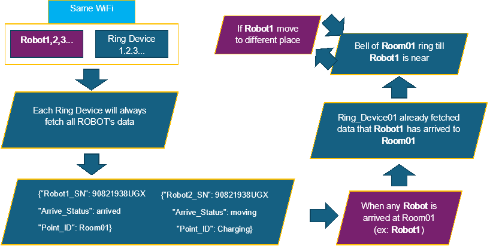

Robots need to be in Same WiFi

Suppose: **Robot1,2,3...** are available for **Ring Device 1,2,3...**

Each Ring Device will always fetch all ROBOT's data

***Data1:*** {"Robot1\_SN": 90821938UGX

"Arrive\_Status": arrived

"Point\_ID": Room01}

***Data2:*** {"Robot2\_SN": 90821938UGX

"Arrive\_Status": moving

"Point\_ID": Charging}

When any **Robot** is arrived at Room01 (ex: **Robot1**)

Ring\_Device01 already fetched data that **Robot1** has arrived to **Room01**

Bell of **Room01** ring till **Robot1** is near

If **Robot1** move to different place **Bell** will stop:

